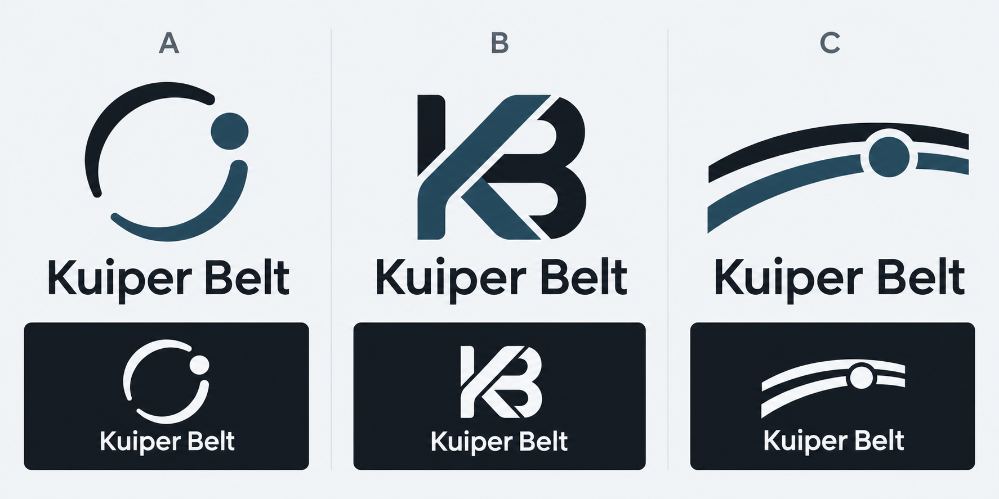

# Kuiper Belt logo proposals

Three concepts generated with the built-in image generation tool on 2026-10-08.
These are proposals for review. The website retains a typographic wordmark until a concept is selected.



- **A — Orbit:** an open orbital belt and one body; recommended for a clear, compact company mark.
- **B — KB:** a compact geometric monogram.
- **C — Belt:** two curved bands and one body.

The slate and charcoal palette follows the existing Kuiper Belt dashboard. A final mark should be redrawn as an SVG and checked at 16, 24 and 32 px after selection.

## Generation prompt

```text
Use case: logo-brand
Asset type: a professional logo concept comparison board for the user's independent software company.
Primary request: Create three genuinely different, carefully drawn logo concepts for "Kuiper Belt", Korean independent software business making practical browser extensions and iPhone apps. The brand also has a restrained developer dashboard aesthetic.
Composition: one clean landscape design presentation, three equal columns labeled only A, B, C. Each column has one large crisp symbol, one exact wordmark "Kuiper Belt", and a small reversed white-on-dark sample of the same mark. Enough breathing room, consistent optical sizing. No extra decorative elements, slogans, fake UI, mockups, captions, or explanatory text.
Concept A: a strong minimal orbital mark, an open circular belt and one small solid body, designed as deliberate simple geometry; clever negative space, no generic Saturn planet.
Concept B: a compact original KB monogram built from two interlocking geometric strokes, balanced negative space, strong readable small silhouette, no imitation of an existing brand.
Concept C: a distinctive belt/horizon mark, two restrained curved parallel bands crossing one tiny body, compact and calm, unmistakably different from A and B.
Style: original, timeless, flat vector-like logo design, mathematically clean edges, dark charcoal #10151c and slate #22485c, white/light cool gray background #f2f4f7. Clean humanist sans-serif wordmark similar to IBM Plex Sans. No green, no serif. Marks work in one color and at favicon size.
Text verbatim: "A", "B", "C", "Kuiper Belt" (repeat company name under each mark).
Avoid: gradients, 3D, glow, shadows, stars and starfields, spacecraft, stock clipart, texture, hairline complexity, brand lookalikes, misspelled lettering. This is a review board of logo proposals, not a final approved logo.
```
